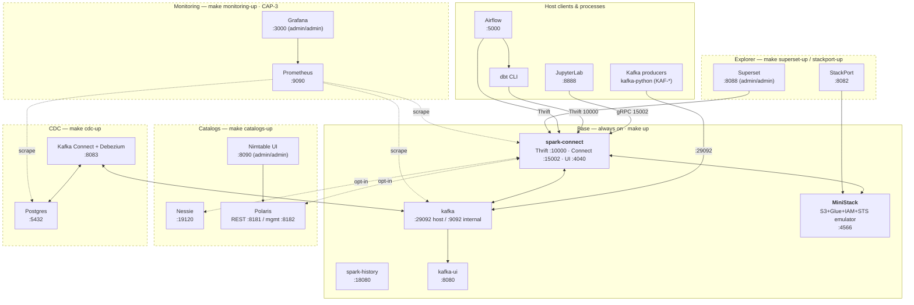

# Lakehouse Lab — Learning Repo

A Docker-based environment for **Apache Spark**, **Iceberg**, **Delta Lake**, **Kafka Structured Streaming**, **dbt**, and **Airflow** — with a unified Spark server so notebooks and dbt jobs share one Spark UI.

---

## Architecture

The base stack (`make up`) is always-on; four opt-in module stacks stack on top of it.



**Key design:**
- Notebooks connect via **Spark Connect** (`sc://localhost:15002`); dbt connects via **Thrift Server** (`jdbc:hive2://localhost:10000`). Both share the **same SparkContext** → all jobs appear in one Spark UI at http://localhost:4040.
- **MiniStack** provides S3/Glue/IAM/STS locally (MIT-licensed, always on) so lessons write to `s3://warehouse/{iceberg,delta,hudi,nessie,glue}/…` — no AWS account required.
- Opt-in stacks (dashed borders) start with their own targets (`make catalogs-up`, `make cdc-up`, `make superset-up`, `make monitoring-up`) and stop with `-down` — none of them are required for the base tracks.

---

## Curriculum (production challenges)

This repo doubles as a self-paced **Data Engineering production-challenges curriculum** — break
real systems at small scale, watch them fail in the Spark UI, fix them, and measure the gain.
Start with [`docs/CURRICULUM_BRIEF.md`](docs/CURRICULUM_BRIEF.md) and
[`docs/CURRICULUM_PLAN.md`](docs/CURRICULUM_PLAN.md).

- **Shared toolkit** in `common/`: `datagen` (synthesize skewed/wide data without storing it),
  `metrics_diff` (before/after query-metric tables), `table_meta` (Iceberg + Hudi table health:
  data-file / snapshot / manifest counts + `.hoodie/` timeline reader), `profiles` (constrained vs
  tuned), `spark_session` (+ `reconnect()`).
- **Resource profiles** (laptop-safe): `make up` runs a tuned ~3 GB Spark box; `make up-constrained`
  runs a ~2 GB box so OOM/spill are real but the host stays usable. Session-level safety nets
  (AQE, broadcast, shuffle partitions) flip per-notebook via `common.profiles.apply_profile()`.
- **Tracks** (each a self-contained module folder following Break→Detect→Fix→Prove):
  - [`spark/`](spark/README.md) — **Phase 1 ✅ complete** · `SPK-1…SPK-10` (skew, executor/driver OOM, spill, joins, AQE, pruning, caching, shuffle, internals)
  - [`iceberg/`](iceberg/README.md) — **Phase 2 ✅ complete** · `LAK-1…LAK-10` (formats, small files, snapshots, orphans, manifests, schema evo, partitioning, MERGE, time travel, internals) + **Phase 2.5 Catalogs** `CAT-1…CAT-5` (Nessie REST, Polaris RBAC, Nessie SQL branching, cross-catalog federation Nessie→Glue) + `catalog_api_playground.ipynb` + **Phase 2.6 Hudi** `LAK-11`, `LAK-12` (Hudi timeline; CoW vs MoR × Iceberg vs Hudi)
  - [`kafka/`](kafka/README.md) — **Phase 3 ✅ complete** · `KAF-1…KAF-6` + `STR-1…STR-3` (hot partitions, consumer lag, rebalancing, retention/compaction, delivery semantics, poison-pill/dead-letter, watermarking, checkpoints, backpressure)
  - [`debezium/`](debezium/README.md) — **Phase 4 ✅ complete** · `CDC-1…CDC-9` (logical replication, connector bring-up, snapshot modes, event envelope, WAL/slot growth, deletes & replica identity, Spark→Iceberg MERGE, schema evolution, failure-mode tour)
  - [`dbt/quality/`](dbt/quality/README.md) — **Phase 5 ✅ complete** · `DBT-1…DBT-10` (materializations, incremental strategies, late-arriving/lookback, SCD2 snapshots, schema-change, testing/layering, quarantine, dbt-expectations + Great Expectations, sources/freshness/contracts/exposures, macros/slim-CI)
  - [`airflow/`](airflow/README.md) — **Phase 6 ✅ complete** · `AF-1…AF-10` (idempotency, execution model, catchup/backfill, retries/SLA, sensor modes, trigger rules/branching, dynamic mapping, XCom limits, assets/data-aware, dbt+Spark e2e)
  - [`capstone/`](capstone/README.md) — **Phase 7 ✅ complete** · `CAP-1` end-to-end pipeline · `CAP-2` [incident simulator](capstone/incident_simulator/) (8 on-call cards) · `CAP-3` [observability](docs/OBSERVABILITY.md) (opt-in `make monitoring-up`: Prometheus + Grafana + exporters) · `CAP-4` [learning path](docs/LEARNING_PATH.md)
- **Start here:** the [**learning path**](docs/LEARNING_PATH.md) orders all 58 modules with time estimates and "what you can diagnose after each."
- **Guides**: [`docs/spark-ui-guide.md`](docs/spark-ui-guide.md) (symptom → which UI tab) and
  [`docs/troubleshooting.md`](docs/troubleshooting.md) (symptom → cause → fix).

---

## Prerequisites

- [**Docker Desktop**](https://www.docker.com/products/docker-desktop/) — allocate **≥ 6 GB RAM** to Docker (Preferences → Resources).
- [**uv**](https://docs.astral.sh/uv/) — Python package manager. Installs Python **3.13+** on demand; you do not need to install Python yourself.
- **Laptop RAM: 8 GB minimum, 16 GB recommended.** The base stack (`make up`) fits in 8 GB. Opt-in stacks stack on top: adding **CDC** (Postgres + Kafka Connect) or **Monitoring** (Prometheus + Grafana + exporters) is comfortable on 16 GB; on an 8 GB host, stop `spark-history` / `kafka-ui` before bringing them up. Every module cleans up with `make clean` (wipes `.tmp/`).
- **macOS**: Airflow (Phase 6) binds `:5000`, which macOS Ventura+ uses for **AirPlay Receiver**. Turn it off at *System Settings → General → AirDrop & Handoff → AirPlay Receiver*, or Airflow will refuse to start.
- **Free ports on the host** (all `localhost`): `4040`, `4566`, `5000`, `5432`, `8080`–`8083`, `8088`, `8090`, `8181`, `8182`, `8888`, `9090`, `9092`, `10000`, `15002`, `18080`, `19120`, `29092`, `3000`. `make status` shows what's up.

---

## Quick Start

```bash
# 1. Clone and enter
git clone <repo-url> lakehouse-lab && cd lakehouse-lab

# 2. Install Python dependencies locally
uv sync

# 3. Start Docker services (Spark + Kafka + History Server)
make up

# 4. Start JupyterLab locally
make jupyter

# 5. Open http://localhost:8888 — then follow docs/LEARNING_PATH.md to pick a module
```

---

## Services & Ports

| Service | URL | Description |
|---------|-----|-------------|
| **Base — always on with `make up`** | | |
| Spark Connect | `sc://localhost:15002` | gRPC endpoint for notebooks |
| Spark Thrift | `jdbc:hive2://localhost:10000` | JDBC endpoint for dbt + Superset |
| Spark UI | http://localhost:4040 | Unified DAG view for all jobs |
| History Server | http://localhost:18080 | Completed Spark applications |
| MiniStack | http://localhost:4566 | S3 + Glue + IAM + STS emulator (OSS, MIT). Data lives at `s3://warehouse/{iceberg,delta,hudi,nessie,glue}/…` |
| Kafka UI | http://localhost:8080 | Topic browser, message inspector |
| Kafka broker | `localhost:29092` | Bootstrap server for producers |
| **Catalogs — `make catalogs-up`** | | |
| Nessie | http://localhost:19120 | Iceberg REST catalog + Git-like branching |
| Polaris | http://localhost:8181 | Iceberg REST + RBAC (API-only — no browser UI; open Nimtable to browse) |
| Polaris health | http://localhost:8182/q/health | Polaris management/health |
| Nimtable | http://localhost:8090 | Iceberg catalog browser UI (admin/admin) — Next.js frontend + Java backend |
| **Explorer — `make superset-up` / `make stackport-up` (profile: explorer)** | | |
| Superset | http://localhost:8088 | Universal SQL explorer over Spark Thrift (admin/admin) |
| StackPort | http://localhost:8082 | Raw MiniStack S3/Glue/IAM resource browser |
| **CDC — `make cdc-up`** | | |
| Postgres (CDC) | `localhost:5432` | CDC source — user/pass `cdc`/`cdc`, db `inventory` |
| Kafka Connect (CDC) | http://localhost:8083 | Debezium connector REST API |
| **Monitoring — `make monitoring-up` (CAP-3)** | | |
| Prometheus | http://localhost:9090 | Metrics scraper |
| Grafana | http://localhost:3000 | Dashboards (admin/admin) |
| **Other** | | |
| JupyterLab | http://localhost:8888 | Local notebook server (`make jupyter`) |
| Airflow | http://localhost:5000 | Local DAG scheduler & web UI (airflow/airflow, Phase 6) |

---

## dbt

dbt-core is integrated via the Spark Thrift Server. All dbt jobs appear in the same Spark UI alongside notebook jobs.

### Usage

```bash
cd dbt
source .env
dbt run -s stg_customers       # run a single model
dbt build                      # seed + run + test (full pipeline)
dbt test -s dim_customers      # test a specific model
```

### Project Structure

```
dbt/
├── dbt_project.yml            # Project config
├── profiles.yml               # Connection config (Thrift → localhost:10000)
├── .env                       # Source this for direct dbt usage
├── seeds/
│   └── customers.csv          # Raw customer data
├── models/
│   ├── staging/
│   │   ├── stg_customers.sql  # Cleaned + typed customer data
│   │   └── _staging__models.yml
│   └── marts/
│       ├── dim_customers.sql  # Customer dimension (regions, tiers, tenure)
│       ├── agg_customers.sql  # Aggregated customer metrics
│       └── _marts__models.yml
└── macros/
    └── generate_schema_name.sql
```

### Models

| Model | Layer | Materialized | Description |
|-------|-------|--------------|-------------|
| `stg_customers` | staging | view | Cleaned customer data with typed dates and tenure |
| `dim_customers` | marts | table | Enriched with region, tier rank, tenure segment |
| `agg_customers` | marts | table | Aggregated customer metrics |

---

## Airflow

Airflow 3.1.7 runs locally via `uv` (separate venv in `airflow/`). It is independent of Docker services.

### Usage

```bash
make airflow-up       # Start in background (webserver + scheduler + triggerer)
make airflow-down     # Stop all Airflow processes
make airflow-logs     # Tail standalone log
make airflow-clean    # Wipe DB + logs for a fresh start
```

- **Web UI:** http://localhost:5000
- **Login:** `airflow` / `airflow`
- **DAGs folder:** `airflow/dags/`
- **Logs:** `airflow/.airflow_home/logs/`
- **Dependencies:** `airflow/pyproject.toml` (isolated from the main project)

### First-time setup

```bash
cd airflow && uv sync    # Install Airflow + providers into airflow/.venv
make airflow-up          # Initializes DB and starts all components
```

---

## Make Targets

```bash
make help             # Show all commands
make up               # Start Docker services — tuned profile (~3 GB Spark)
make up-constrained   # Start Docker services — constrained profile (~2 GB Spark; OOM/spill modules)
make down             # Stop Docker services
make restart          # Restart everything (tuned)
make restart-constrained # Restart everything (constrained profile)
make logs             # Tail service logs
make status           # Show service status
make jupyter          # Start local JupyterLab
make airflow-up       # Start Airflow locally (UI at :5000, airflow/airflow)
make airflow-down     # Stop Airflow
make airflow-logs     # Tail Airflow logs
make airflow-clean    # Stop + wipe Airflow state (fresh start)
make dbt-build        # Run full dbt pipeline (seed + run + test)
make dbt-debug        # Verify dbt connection
make clean            # Remove generated data
make clean-all        # Remove data + Docker volumes
```

---

## Configuration

| File | Purpose |
|------|---------|
| `.env` | Ports, Spark remote URL, Kafka address, dbt vars, resource-profile vars (`SPARK_MEM_LIMIT` / `SPARK_DRIVER_MEMORY` / `SPARK_CORES`) |
| `conf/spark-defaults.conf` | Spark server config (catalogs, memory, extensions) |
| `conf/log4j2.properties` | Logging levels |
| `dbt/profiles.yml` | dbt connection config (uses env vars from `dbt/.env`) |
| `airflow/pyproject.toml` | Airflow dependencies (separate uv project) |
| `airflow/passwords.json` | Airflow local auth credentials |

### Spark Catalogs — 5 registered

| Catalog | Format | Physical location | Notes |
|---------|--------|-------------------|-------|
| `spark_catalog` | Delta (default owner) + Hudi via `USING hudi + LOCATION` | `s3a://warehouse/delta/…` and `s3a://warehouse/hudi/…` | DeltaCatalog owns spark_catalog; Hudi rides through with explicit `LOCATION` |
| `iceberg_catalog` | Iceberg (Hadoop catalog) | `s3a://warehouse/iceberg/…` | Filesystem-semantics catalog on S3 |
| `nessie_catalog` | Iceberg (Nessie native `/api/v2`, `client-api-version=2`) | `s3a://warehouse/nessie/…` | Git-like branching via `CREATE BRANCH` / `USE REFERENCE` / `MERGE BRANCH` SQL |
| `polaris_catalog` | Iceberg REST + RBAC | `s3a://warehouse/polaris/…` | Read + RBAC lessons only; write STS-blocked on MiniStack Community |
| `glue_catalog` | Iceberg via GlueCatalog | `s3a://warehouse/glue/…` | Real Glue-shape catalog on MiniStack; static creds, no STS |

See `docs/CATALOG_FORMAT_MATRIX.md` for the full supported (catalog × format) grid + why each hole exists.

---

## Project Structure

```
lakehouse-lab/
├── docker-compose.yml          # Thin `include:` of services/*/compose.yml
├── Makefile                    # Thin `include` of make/*.mk
├── .env                        # Environment variables (ports, mem limits, profiles)
├── conf/
│   ├── spark-defaults.conf     # 5 catalogs (Iceberg/Delta/Hudi/Nessie/Polaris/Glue), Kryo, extensions
│   └── log4j2.properties       # Logging config
├── scripts/docker-entrypoint.sh  # Container-DNS --conf overrides
├── services/                   # Per-service compose + Dockerfile + README + scripts
│   ├── spark/                  # spark-connect + spark-history + Dockerfile (Spark 4.0.2)
│   ├── ministack/              # S3+Glue+IAM+STS emulator (always-on)
│   ├── kafka/                  # kafka + kafka-ui
│   ├── cdc/                    # postgres + kafka-connect (profile: cdc)
│   ├── catalogs/               # nessie + polaris + polaris-postgres + nimtable + nimtable-web (profile: catalogs)
│   ├── explorer/               # Superset universal SQL explorer (profile: explorer)
│   ├── stackport/              # StackPort AWS-resource browser (profile: explorer)
│   └── monitoring/             # prometheus + grafana + exporters (profile: monitoring)
├── make/                       # Per-subsystem targets (base.mk, catalogs.mk, cdc.mk, …)
├── common/                     # Shared curriculum toolkit
│   ├── spark_session.py        # Spark session helper (auto-warms all catalogs)
│   ├── profiles.py             # constrained vs tuned session profiles
│   ├── datagen.py              # synthetic data generators (skew knob)
│   ├── metrics_diff.py         # before/after metrics tables
│   ├── table_meta.py           # Iceberg (.snapshots/.files/.manifests) + Hudi (.hoodie/ + s3_client/split_s3/wipe_prefix)
│   ├── catalog_meta.py         # Nessie REST cross-check
│   ├── kafka_helpers.py        # ensure_topic, produce, consumer_group_lag (kafka-python 3.0+)
│   └── cdc_helpers.py          # Debezium connector wiring
├── spark/                      # Phase 1 ✅ Spark performance pathologies (SPK-1 skew flagship)
├── iceberg/                    # Phase 2 ✅ Iceberg (LAK-1..10) + Phase 2.5 Catalogs (CAT-1..5) + Phase 2.6 Hudi (LAK-11, LAK-12)
├── kafka/                      # Phase 3 ✅ Kafka & Structured Streaming robustness (KAF-1..6, STR-1..3)
├── debezium/                   # Phase 4 ✅ CDC: Postgres→Debezium→Kafka→Spark→Iceberg (CDC-1..9)
├── capstone/                   # Phase 7 ✅ CAP-1 e2e pipeline + CAP-2 incident simulator (8 cards)
├── docs/                       # curriculum brief/plan, spark-ui-guide, troubleshooting
├── airflow/                    # Airflow project (separate uv env)
│   ├── pyproject.toml          # Airflow + provider dependencies
│   ├── passwords.json          # Local auth (airflow/airflow, role: admin)
│   └── dags/                   # Phase 6 ✅ teaching DAGs (AF-1..10) + example_dag
├── dbt/                        # dbt project (models, seeds, tests) + quality/ (Phase 5 ✅ DBT-1..10 + GE)
├── pyproject.toml              # Python dependencies
└── .tmp/                       # Generated data (gitignored)
```

---

## How the Unified Server Works

The Docker container runs **one Spark application** that exposes two interfaces:

```
dbt ─────────── Thrift (JDBC :10000) ──┐
                                        ├── Same SparkContext → Spark UI :4040
Notebooks ───── Connect (gRPC :15002) ─┘
```

This is achieved by starting the Spark **Thrift Server** (`HiveServer2`) with the **Spark Connect plugin** enabled in the same JVM. JARs (Iceberg, Delta, Kafka) are pre-installed in the Docker image for fast startup and classloader compatibility.

---

## Troubleshooting

**Spark not starting?**
```bash
docker compose logs spark-connect    # Check logs
make restart                         # Restart everything
```

**dbt can't connect?**
```bash
# Verify the Thrift port is open
nc -z localhost 10000 && echo OK

# Check dbt config
cd dbt && source .env && dbt debug
```

**Port conflict?**
Edit `.env` to change any port, then `make restart`.
